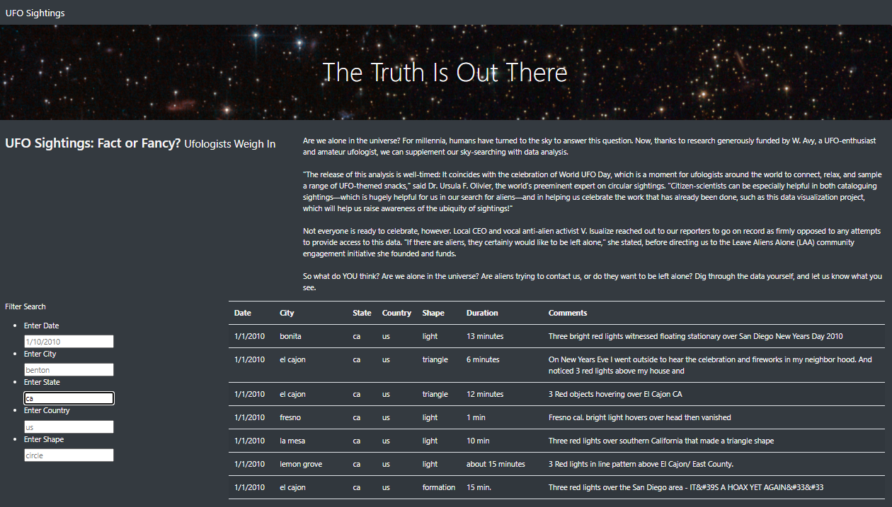

# UFO Analysis

## Objetive

Create a web table stored as a JavaScript array with the ability to filter data based on multiple criteria captured from user input.

The main challenges of this project are to fully understand the use of d3-selection methods to be able to capture an event to listen for changes and make possible the interactivity of the web page with users' input, and also being able to build and deploy JavaScript functions and convert it into arrow functions, and forEach functions.

## Building the Webpage with JS

Using the standard structure for this project with CSS, HTML, and JS, the web page was built. All the logic is on the app.js file behind the filter interactivity with the table.

As could be seen below the Web Page filters work, as the user write the right input.

- Date filter:

- Shape filter:

- State filter:

Also Web page full funtionability can see on [github page](https://enricoroblesdelrio.github.io/UFOs/index.html)

## Final Thoughts

Despite that the code works as the project request, the UX is not the best, and need to improve to avoid a bad experience or errors consulting data, with a few more hours of development filters with a dropdown menu could be added to deliver a better UX functionability.
